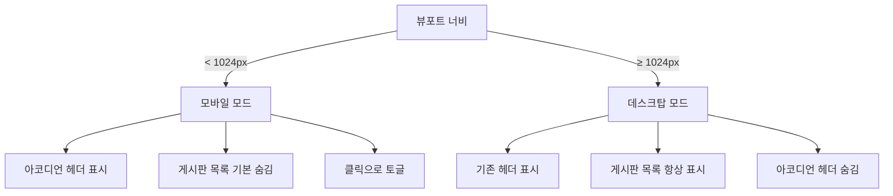

# Design Document: Mobile Sidebar Accordion

## Overview

boardList 페이지의 좌측 사이드바("종목별 게시판")를 모바일 화면(< 1024px)에서 아코디언 UI로 전환한다. 데스크탑(≥ 1024px)에서는 기존 항상-펼쳐진 사이드바를 유지하고, 모바일에서만 접기/펼치기 동작을 추가한다.

이 변경은 순수 프론트엔드 작업이다. 백엔드(Controller, Service, Mapper) 변경은 없으며, `boardList.html` 템플릿의 `<aside>` 영역과 인라인 JavaScript만 수정한다.

### 기술 스택

- **템플릿**: Thymeleaf (layout dialect)
- **CSS**: Tailwind CSS (CDN), Bootstrap 5 (아이콘만 사용)
- **JS**: Vanilla JavaScript (jQuery 의존 없음 — 아코디언 로직은 순수 JS)
- **반응형 기준**: Tailwind `lg` 브레이크포인트 = 1024px

### 설계 원칙

1. **최소 변경**: boardList.html의 `<aside>` 내부만 수정. 다른 파일 변경 없음
2. **CSS-first 반응형**: Tailwind의 `lg:` 프리픽스로 데스크탑/모바일 분기. JS는 토글 로직에만 사용
3. **점진적 향상**: JS 비활성화 시에도 게시판 목록이 보이도록 기본 상태 설계
4. **접근성 우선**: WAI-ARIA Accordion 패턴 준수

## Architecture

### 변경 범위

```
boardList.html
└── <aside> (사이드바)
    ├── [신규] Accordion Header (<button>) — 모바일에서만 표시
    │   ├── "종목별 게시판" 텍스트
    │   ├── 현재 선택된 게시판 이름 (접힌 상태에서 표시)
    │   └── 펼침/접힘 아이콘 (chevron)
    ├── [기존 유지] 데스크탑 헤더 — lg 이상에서만 표시
    └── [수정] Accordion Body (<div>)
        ├── "전체 게시판" 링크
        └── 개별 게시판 링크 (th:each)
```

### 반응형 전략



### 상태 관리

아코디언 상태는 JavaScript 변수 없이 DOM 속성으로 관리한다:

- `aria-expanded="true|false"` on `<button>` → 현재 상태의 진실 공급원(source of truth)
- Accordion Body의 `max-height` + `overflow: hidden` → CSS 트랜지션으로 슬라이드 애니메이션
- Tailwind `hidden lg:block` → 데스크탑에서는 항상 표시

## Components and Interfaces

### 1. Accordion Header (모바일 전용)

```html
<button id="sidebar-accordion-toggle"
        class="lg:hidden w-full flex items-center justify-between px-4 py-3 
               border-b border-gray-100 text-sm font-semibold text-[#222222]"
        aria-expanded="false"
        aria-controls="sidebar-accordion-body"
        onclick="toggleSidebarAccordion()">
    <span class="flex items-center gap-2">
        <span>종목별 게시판</span>
        <!-- 접힌 상태에서 현재 게시판 표시 -->
        <span id="sidebar-current-board" 
              class="text-xs font-normal text-[#767676]"
              th:text="${currentType != null} ? '· ' + ${currentType.boardTypeName} : '· 전체 게시판'">
        </span>
    </span>
    <i class="bi bi-chevron-down text-[#767676] transition-transform duration-300"
       id="sidebar-accordion-icon"></i>
</button>
```

**동작**:
- `lg:hidden`: 1024px 이상에서 자동 숨김
- 클릭 시 `toggleSidebarAccordion()` 호출
- `aria-expanded` 값에 따라 아이콘 회전 (180deg)
- 접힌 상태에서 현재 게시판 이름 표시, 펼쳐지면 숨김

### 2. Desktop Header (기존 유지)

```html
<div class="hidden lg:block px-4 py-3 border-b border-gray-100">
    <h3 class="text-sm font-semibold text-[#222222]">종목별 게시판</h3>
</div>
```

**동작**:
- `hidden lg:block`: 1024px 미만에서 숨김, 이상에서 표시
- 기존 코드 그대로 유지

### 3. Accordion Body

```html
<div id="sidebar-accordion-body"
     role="region"
     aria-labelledby="sidebar-accordion-toggle"
     class="overflow-hidden transition-[max-height] duration-300 ease-in-out
            max-h-0 lg:max-h-none lg:overflow-visible">
    <div class="px-2 py-2">
        <!-- 기존 게시판 링크 목록 (변경 없음) -->
    </div>
</div>
```

**동작**:
- 모바일 기본: `max-h-0` + `overflow-hidden` → 접힌 상태
- 데스크탑: `lg:max-h-none lg:overflow-visible` → 항상 펼쳐짐
- 토글 시 JS가 `max-height`를 `scrollHeight`로 설정 → 슬라이드 애니메이션

### 4. Toggle Function

```javascript
function toggleSidebarAccordion() {
    var toggle = document.getElementById('sidebar-accordion-toggle');
    var body = document.getElementById('sidebar-accordion-body');
    var icon = document.getElementById('sidebar-accordion-icon');
    var currentBoard = document.getElementById('sidebar-current-board');
    var isExpanded = toggle.getAttribute('aria-expanded') === 'true';

    if (isExpanded) {
        // 접기
        body.style.maxHeight = body.scrollHeight + 'px';
        requestAnimationFrame(function() {
            body.style.maxHeight = '0px';
        });
        toggle.setAttribute('aria-expanded', 'false');
        icon.style.transform = 'rotate(0deg)';
        if (currentBoard) currentBoard.style.display = '';
    } else {
        // 펼치기
        body.style.maxHeight = body.scrollHeight + 'px';
        body.addEventListener('transitionend', function handler() {
            body.style.maxHeight = 'none';
            body.removeEventListener('transitionend', handler);
        });
        toggle.setAttribute('aria-expanded', 'true');
        icon.style.transform = 'rotate(180deg)';
        if (currentBoard) currentBoard.style.display = 'none';
    }
}
```

**설계 결정**:
- `scrollHeight` 기반 애니메이션: CSS `max-height: auto`는 트랜지션이 안 되므로, JS로 실제 높이를 계산하여 설정
- 접기 시 `requestAnimationFrame` 사용: 브라우저가 `scrollHeight` 값을 렌더링한 후 `0px`로 전환해야 애니메이션이 동작
- 펼치기 완료 후 `max-height: none` 설정: 내부 콘텐츠가 동적으로 변할 경우를 대비
- `transitionend` 이벤트 리스너는 일회성(`{ once: true }` 대신 수동 제거 — IE 호환성)

## Data Models

이 기능은 순수 프론트엔드 변경이므로 새로운 데이터 모델은 없다. 기존 Thymeleaf 모델 속성을 그대로 사용한다:

| 모델 속성 | 타입 | 용도 |
|-----------|------|------|
| `boardTypes` | `List<BoardType>` | 게시판 종목 목록 (사이드바 링크 생성) |
| `typeCode` | `String` (nullable) | 현재 선택된 게시판 코드 (null이면 전체) |
| `currentType` | `BoardType` (nullable) | 현재 선택된 게시판 객체 (이름 표시용) |

### DOM 상태 모델

아코디언의 상태는 DOM 속성으로 관리된다:

| 속성 | 위치 | 값 | 의미 |
|------|------|-----|------|
| `aria-expanded` | `#sidebar-accordion-toggle` | `"true"` / `"false"` | 아코디언 펼침/접힘 상태 |
| `style.maxHeight` | `#sidebar-accordion-body` | `"0px"` / `"{n}px"` / `"none"` | 애니메이션 제어 |
| `style.transform` | `#sidebar-accordion-icon` | `"rotate(0deg)"` / `"rotate(180deg)"` | 아이콘 회전 |
| `style.display` | `#sidebar-current-board` | `""` / `"none"` | 현재 게시판 이름 표시 여부 |


## Error Handling

이 기능은 순수 프론트엔드 UI 변경이므로 서버 에러 처리는 해당 없다. 클라이언트 측 방어 코드만 필요하다.

### JavaScript 방어 처리

| 시나리오 | 처리 방식 |
|----------|-----------|
| DOM 요소 미발견 (`getElementById` 반환 null) | `toggleSidebarAccordion()` 내부에서 요소 존재 여부 확인 후 조기 반환 |
| JS 비활성화 | 모바일에서 아코디언 body의 초기 상태를 CSS로 `max-h-0`으로 설정하되, `<noscript>` 또는 CSS fallback으로 목록이 보이도록 처리 가능. 단, 현재 프로젝트가 JS 필수 환경이므로 우선순위 낮음 |
| `transitionend` 이벤트 미발생 | 펼치기 시 `setTimeout` fallback (300ms) 추가하여 `max-height: none` 설정 보장 |
| 빠른 연속 클릭 | `transitionend` 리스너를 매번 새로 등록하고 이전 것을 제거하므로, 중간 상태에서도 정상 동작. `scrollHeight` 재계산으로 현재 높이 기준 애니메이션 |

### CSS Fallback

데스크탑에서는 `lg:max-h-none lg:overflow-visible` 클래스가 JS와 무관하게 항상 콘텐츠를 표시한다. JS 오류가 발생해도 데스크탑 레이아웃에는 영향 없다.

## Testing Strategy

### PBT 적용 여부

이 기능에는 Property-Based Testing을 적용하지 않는다.

**이유:**
- 순수 UI 렌더링 및 CSS 반응형 레이아웃 변경이다
- JavaScript 토글 함수는 단순 DOM 조작으로, 입력에 따라 동작이 의미 있게 달라지지 않는다
- Thymeleaf 서버 사이드 렌더링은 결정적(deterministic) 출력이다
- "모든 입력 X에 대해 속성 P(X)가 성립한다"는 형태의 보편적 속성을 정의할 수 없다

대신 example-based 테스트와 수동 테스트로 검증한다.

### 테스트 계층

#### 1. 수동 브라우저 테스트 (필수)

| 테스트 항목 | 검증 내용 | 뷰포트 |
|------------|-----------|--------|
| 모바일 초기 상태 | 아코디언 헤더 표시, 목록 숨김 | < 1024px |
| 데스크탑 초기 상태 | 기존 사이드바 그대로 표시, 아코디언 헤더 숨김 | ≥ 1024px |
| 아코디언 펼치기 | 헤더 클릭 → 목록 슬라이드 다운, 아이콘 회전 | < 1024px |
| 아코디언 접기 | 헤더 재클릭 → 목록 슬라이드 업, 아이콘 복원 | < 1024px |
| 현재 게시판 표시 | 특정 게시판 선택 시 접힌 헤더에 이름 표시 | < 1024px |
| 전체 게시판 표시 | typeCode 없을 때 "전체 게시판" 표시 | < 1024px |
| 링크 동작 | 아코디언 내 게시판 링크 클릭 → 정상 이동 | < 1024px |
| 활성 게시판 강조 | 펼친 상태에서 현재 게시판 하이라이트 | < 1024px |
| 뷰포트 리사이즈 | 모바일 → 데스크탑 전환 시 사이드바 정상 표시 | 전환 |
| 키보드 접근성 | Tab → Enter/Space로 아코디언 토글 | < 1024px |

#### 2. 접근성 검증

| 검증 항목 | 방법 |
|-----------|------|
| `aria-expanded` 상태 동기화 | 브라우저 DevTools로 토글 전후 속성 확인 |
| `aria-controls` / `aria-labelledby` 연결 | DevTools에서 ID 참조 확인 |
| `role="region"` 존재 | DevTools에서 확인 |
| 키보드 포커스 | Tab 키로 아코디언 헤더에 포커스 도달 확인 |
| 스크린 리더 | VoiceOver/NVDA로 "종목별 게시판, 접힘/펼침" 안내 확인 |

#### 3. 크로스 브라우저 테스트

| 브라우저 | 확인 사항 |
|----------|-----------|
| Chrome (모바일/데스크탑) | 전체 기능 |
| Safari (iOS) | 터치 이벤트, CSS 트랜지션 |
| Firefox | 전체 기능 |
| Samsung Internet | 기본 동작 |

### 회귀 테스트 체크리스트

- [ ] 데스크탑에서 기존 사이드바 레이아웃 변경 없음
- [ ] 게시판 링크 URL 변경 없음
- [ ] 게시판 목록 데이터(boardTypes) 렌더링 변경 없음
- [ ] 활성 게시판 하이라이트 스타일 유지
- [ ] 검색, 페이지네이션 등 다른 기능에 영향 없음
